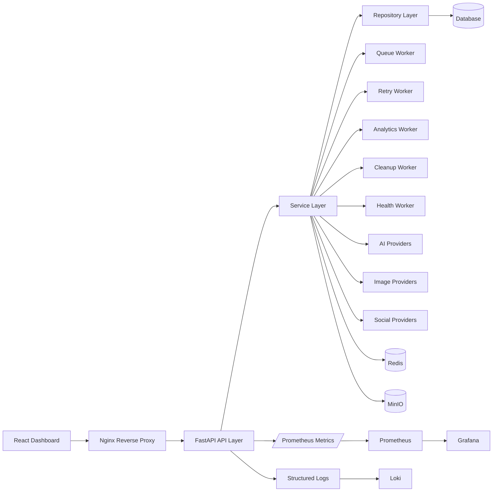

# Architecture Diagram

```mermaid
flowchart LR
  FE[React Dashboard] --> NX[Nginx Reverse Proxy]
  NX --> API[FastAPI API Layer]
  API --> SVC[Service Layer]
  SVC --> REPO[Repository Layer]
  REPO --> DB[(Database)]

  SVC --> QW[Queue Worker]
  SVC --> RW[Retry Worker]
  SVC --> AW[Analytics Worker]
  SVC --> CW[Cleanup Worker]
  SVC --> HW[Health Worker]

  SVC --> AI[AI Providers]
  SVC --> IMG[Image Providers]
  SVC --> SOC[Social Providers]

  API --> METRICS[/Prometheus Metrics/]
  API --> LOGS[Structured Logs]
  LOGS --> LOKI[Loki]
  METRICS --> PROM[Prometheus]
  PROM --> GRAF[Grafana]

  SVC --> REDIS[(Redis)]
  SVC --> MINIO[(MinIO)]
```
